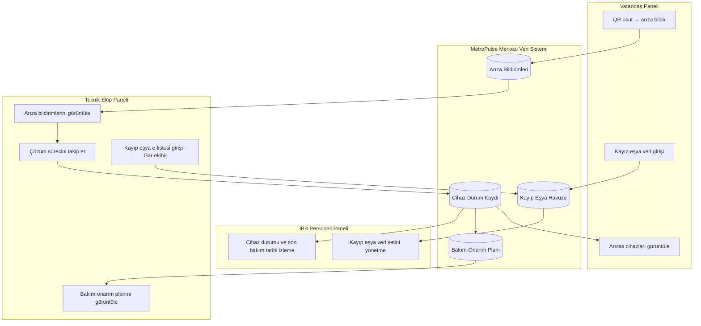
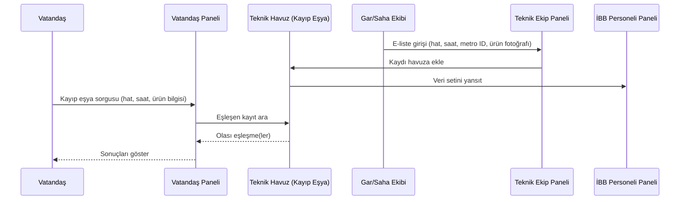
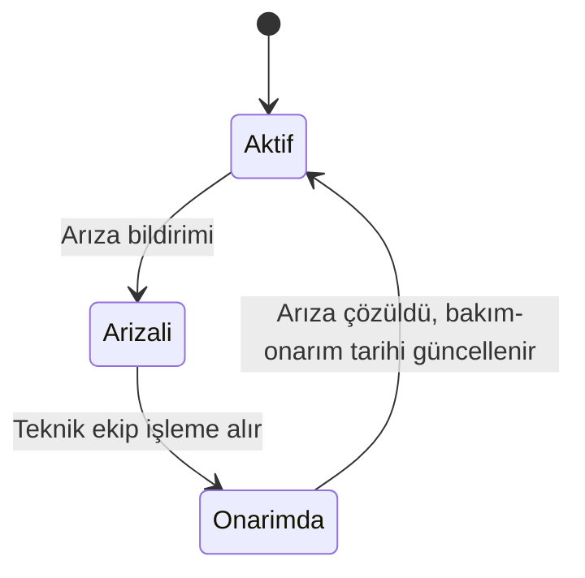
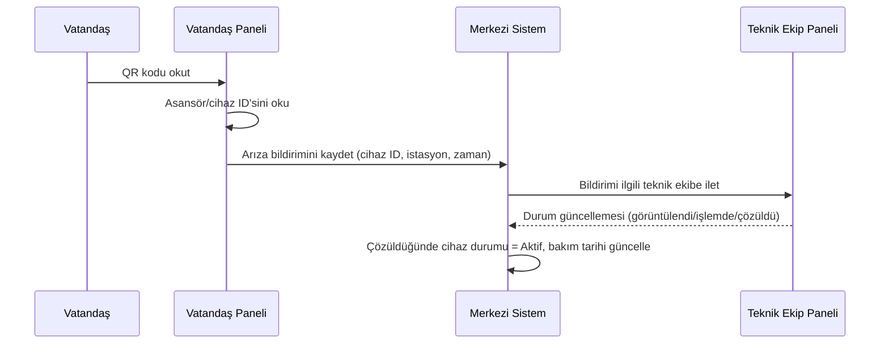
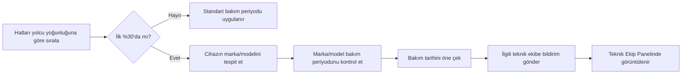

# MetroPulse — Proje Niyet Dokümanı (Intent)

## 1. Amaç

MetroPulse, İBB Metro İstanbul'a bağlı tüm hatlardaki **yürüyen merdiven,
yürüyen bant ve asansörlerin** arıza durumlarını anlık takip etmek; arızaları
teknik ekiplere hızlı ve doğru şekilde iletmek; **kayıp eşyaları sahibiyle
buluşturmak**; ve yoğun kullanılan hatlarda asansör/yürüyen merdiven bakım
periyotlarının sıklaştırılması yönünde analiz sunmak amacıyla geliştirilen
bir mobil uygulamadır.

Bu doküman, projenin kapsamını tanımlar ve **bu kapsamın dışına
çıkılmayacağını** bağlayıcı bir sınır olarak belirler.

---

## 2. Hedef Kitle ve Panel Yapısı

Hedef kitle: **Metro İstanbul kullanan vatandaşlar** ve **İBB personeli**
(kurum içi izleme/yönetim personeli ile teknik ekipler dahil).

Sistem üç ayrı panelden oluşur; bu üç panelin dışında yeni bir panel/rol bu
proje kapsamında değildir:

| Panel | Kullanıcı | Temel İşlevler |
|---|---|---|
| Vatandaş Paneli | Genel halk | Arızalı cihazları görüntüleme, QR ile arıza bildirimi, kayıp eşya veri girişi |
| İBB Personeli Paneli | Kurum içi izleme/yönetim personeli | Cihaz durumu + son bakım-onarım tarihi görüntüleme, kayıp eşya veri setinin yönetimi |
| Teknik Ekip Paneli | Arıza çözüm ve bakım ekipleri | Arıza bildirimlerini ve bakımları görüntüleme, çözüm sürecini takip etme, bakım-onarım önceliklendirme |

---

## 3. Sistem Mimarisi

Tek bir merkezi veri kaynağı vardır; üç panel bu kaynağı farklı yetki ve
görünürlük seviyeleriyle okur/yazar. Panel dışı entegrasyon veya ek sistem
bu aşamada tanımlanmaz.

---

## 4. Panel Detayları

### 4.1 Vatandaş Paneli

- Metro hattı/istasyon bazında arızalı yürüyen merdiven, yürüyen bant ve
 asansörleri görüntüler.
- QR kod okutarak asansör/yürüyen merdiven/bant ID'sini otomatik alır ve
 arıza bildirimi oluşturur.
- Kayıp eşyasını bulmak için hat bilgisi, saat bilgisi ve ürün bilgisi
 girerek kayıt oluşturur.

### 4.2 İBB Personeli Paneli

- Tüm metrolardaki cihazların durumunu (arızalı/aktif) ve son bakım-onarım
 tarihini görüntüler.
- Kayıp eşyaların durumunu yönetir; teknik havuzda toplanan e-liste
 kayıtlarından oluşan veri setini tutar.
- Bu panel salt izleme ve veri seti yönetimi amaçlıdır; arıza çözüm
 operasyonu ve bakım planlaması Teknik Ekip Panelinin sorumluluğundadır.

### 4.3 Teknik Ekip Paneli

- Vatandaşlardan gelen arıza bildirimlerini ve planlanan bakımları
 görüntüler.
- Arıza çözüm sürecini takip eder (bkz. §6).
- Gara ulaşan, metrolarda unutulan eşyaların takibini yapan ekip için
 e-liste giriş ekranını içerir (bkz. §5.3).
- Bakım-onarım önceliklendirme modülünü içerir; bu modül **yalnızca bu
 panelde** görünür (bkz. §7).

---

## 5. Modül 1 — Kayıp Eşya Yönetimi

### 5.1 Bağlam

Vatandaşlar yılda on binlerce eşyasını metrolarda unutmakta ve bu durum
Metro İstanbul'u zorlamaktadır (2024'te 57.340, 2022'de 36.913 eşya
unutulmuş — kaynak: metro.istanbul haberleri). Modül, bu hacme uygun şekilde
yüksek sayıda kaydı arızasız işleyebilecek, aranabilir ve fotoğraf destekli
bir veri havuzu üzerine kurulur.

### 5.2 Rol 1 — Vatandaş

Vatandaş, kayıp eşyasını bulmak için Vatandaş Panelinden şu bilgileri girer:

- Hat bilgisi
- Saat bilgisi
- Ürün bilgisi

### 5.3 Rol 2 — Gar/Saha Ekibi (Teknik Ekip Paneli)

Gara ulaşan ve metrolarda unutulan eşyaların takibini yapan ekip, Teknik
Ekip Panelinden aşağıdaki alanları içeren e-listeyi doldurur:

- Hat bilgisi
- Saat bilgisi
- Metro ID
- Ürün fotoğrafı

Bu kayıtlar **teknik havuzda** toplanır ve İBB Personeli Panelinde veri seti
olarak tutulur.

### 5.4 Kayıp Eşya Eşleştirme Akışı

---

## 6. Modül 2 — Cihaz Durum Takibi

Her cihaz (yürüyen merdiven, yürüyen bant, asansör) için tutulan asgari veri
seti:

- Cihaz tipi (yürüyen merdiven / yürüyen bant / asansör)
- Bağlı olduğu hat ve istasyon (Metro ID)
- Güncel durum: **Arızalı** veya **Aktif**
- Son bakım tarihi
- Son arıza tarihi ve nedeni

Bu veri seti, İBB Personeli Panelinde görüntüleme; Teknik Ekip Panelinde ise
arıza çözüm sürecinin dayanağı olarak kullanılır.

---

## 7. Modül 3 — Arıza Bildirimi

### 7.1 Akış

Vatandaş, arızalı gördüğü yürüyen merdiven/bant/asansörün üzerindeki QR kodu
okutur; sistem cihaz ID'sini otomatik ekler. Bildirim ilgili teknik ekibe
iletilir ve Teknik Ekip Panelinde görüntülenir.

---

## 8. Modül 4 — Bakım-Onarım Yönetimi (Yalnızca Teknik Ekip Paneli)

Bu modül, önceki modüllerden farklı olarak **yalnızca Teknik Ekip
Panelinde** görünür; ne Vatandaş ne de İBB Personeli Paneline yansıtılır.

### 8.1 Yoğunluk Bazlı Önceliklendirme

- Tüm hatlar yolcu kullanım yoğunluğuna göre sıralanır.
- En yoğun kullanılan hatların **ilk %30'una** ait asansör ve yürüyen
 merdivenlerin periyodik bakımları, kullanım yoğunluğu nedeniyle öne
 çekilir.
- Öne çekilen bakımlar için ilgili teknik ekiplere bildirim yapılır.

### 8.2 Marka/Model Bazlı Bakım Periyodu

- Asansör ve yürüyen merdivenlerin marka/modeli araştırılır.
- İlgili marka/model için üretici tarafından belirlenen bakım periyotları
 kontrol edilir.
- Bu periyotlar, öne çekme sürecinde referans olarak kullanılır; öne çekilen
 yeni bakım tarihi, marka/model periyodunu esas alarak belirlenir.

### 8.3 Akış

---

## 9. Kapsam Dışı

Aşağıdakiler bu proje kapsamında **değildir** ve bu sürümde ele
alınmayacaktır:

- Yukarıdaki üç panelin (Vatandaş, İBB Personeli, Teknik Ekip) dışında yeni
 bir panel/rol tanımlanması
- Metro dışı toplu taşıma araçları (otobüs, metrobüs, tramvay, füniküler vb.)
- Cihazların IoT/sensör tabanlı otomatik arıza tespiti (arıza girişi bu
 sürümde QR ile vatandaş bildirimine dayanır)
- Kayıp eşyanın vatandaşa fiziksel teslimi/kargo süreci (kapsam yalnızca
 eşleştirme ve veri takibiyle sınırlıdır)
- Ödül, puan, teşvik veya ödeme entegrasyonu içeren herhangi bir mekanizma
- İstasyon bazlı erişilebilirlik skoru veya benzeri türetilmiş metrikler
- Sosyal medya paylaşımı, topluluk/forum özellikleri
- Reklam, üçüncü taraf ticari entegrasyonlar

---

## 10. Sonraki Adımlar

1. Cihaz, kayıp eşya kaydı, arıza bildirimi ve bakım planı için veri
  modelinin detaylandırılması.
2. QR kod standardının (cihaz ID formatı, etiket yerleşimi) belirlenmesi.
3. Hat bazlı yolcu yoğunluğu verisinin kaynağının ve güncelleme sıklığının
  netleştirilmesi.
4. Asansör/yürüyen merdiven marka-model envanterinin çıkarılması ve üretici
  bakım periyotlarının derlenmesi.
5. Üç panel için ayrı ayrı kimlik doğrulama ve yetkilendirme modelinin
  tanımlanması.